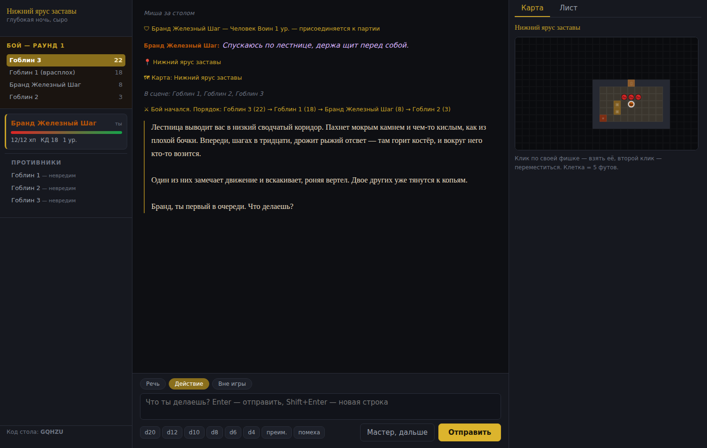

# Мастер подземелий

D&D 5-й редакции в чате для компании, у которой некому водить. Мастера играет
нейросеть, правила считает движок, кубики бросает сервер — и каждый бросок
видно всем за столом.



## Что здесь происходит

Главная идея — разделение труда. Модель решает, **что происходит дальше**: кто
нападает, какая сложность у проверки, что говорит трактирщик, куда ведёт
коридор. Всё остальное считает код:

| Решает нейросеть | Считает движок |
| --- | --- |
| Какую проверку потребовать и с какой СЛ | Бросок d20, преимущество, помеха, успех или провал |
| Кто на кого нападает | Попадание, крит, урон, сопротивления, хиты |
| Каких монстров вывести | Их характеристики из SRD, инициатива, порядок ходов |
| Как выглядит подземелье | Генерацию карты, проходимость, туман войны |
| Что персонажи находят | Инвентарь, монеты, опыт, повышение уровня |

Мастер физически не может «подкрутить» бросок: он вызывает инструмент, сервер
бросает кубик и возвращает результат, а игроки видят тот же результат в логе.
Если модель напишет «выпало 17», не бросив кубик, расхождение будет заметно
сразу.

## Как запустить

Сборки две. Они делят весь код — движок, интерфейс, промпт и инструменты
мастера — и отличаются только тем, где стоит стол.

### Один файл, ничего не устанавливая

**[`dnd-master.html`](dnd-master.html)** — скачай и открой двойным щелчком. Внутри
уже лежит всё: движок правил, справочник SRD, интерфейс и мастер. Ни Node, ни
сервера, ни интернета для самой страницы не нужно — она даже работает офлайн,
пока не позовёт мастера.

При первом запуске впиши ключ Anthropic API (берётся на
https://console.anthropic.com/settings/keys). Ключ хранится только в твоём
браузере и уходит только на `api.anthropic.com` — страница обращается туда
напрямую. Кампания сохраняется там же, в браузере; кнопка «Сохранить в файл» в
настройках стола выгружает её, чтобы перенести на другой компьютер.

Играется за одним экраном: героев можно завести сколько угодно, а кто сейчас
ходит — выбирается кнопкой над полем ввода. Это вариант для компании, которая
сидит вокруг одного ноутбука или делится экраном в созвоне.

Пересобрать файл после правок в коде: `npm run build:standalone`.

### Сервер, чтобы каждый играл со своего устройства

Нужен Node.js 20 или новее.

```bash
cd dnd-master
npm install
cp .env.example .env      # впиши ANTHROPIC_API_KEY
npm start
```

Открой http://localhost:3000, создай стол, выбери героя — и играй. Код стола из
пяти букв дай друзьям, они заходят по нему. Ключ здесь лежит на сервере, игроки
его не видят.

Без ключа обе сборки работают, но мастера придётся отыгрывать человеку.

### Как позвать друзей

Сервер поднимается на твоей машине, поэтому нужен способ до неё достучаться:

- **Одна сеть** (все дома или в одном офисе) — раздай свой локальный адрес:
  `http://192.168.x.x:3000`. Адрес смотри через `ipconfig` / `ifconfig`.
- **Через интернет, быстро** — туннель: `cloudflared tunnel --url http://localhost:3000`
  или `ngrok http 3000`. Получишь ссылку, которую можно кинуть в чат.
- **Постоянно** — задеплой на любой VPS или на Railway/Render/Fly. Нужен только
  Node и один открытый порт; состояние лежит в файлах в `server/data/tables/`.

## Интерфейс

Три колонки: слева партия, инициатива и задачи, по центру лента, справа карта и
лист персонажа. Всё рисуется в браузере из чистого HTML, CSS и ES-модулей — ни
сборки, ни фреймворка, ни единого внешнего запроса: иконки встроены как SVG,
текстура и виньетка сделаны градиентами, карта рисуется на canvas.

Речь мастера набрана антиквой на пергаментном тоне — её видно в ленте сразу.
Броски приходят не строчкой лога, а карточкой: видно каждую кость, отброшенные
при преимуществе, натуральные 20 и 1, итог и исход проверки. На карте горит свет
вокруг героев, разведанное поодаль тускнеет «по памяти», а неразведанное лежит в
темноте; фишки переезжают в новую клетку плавно.

На телефоне колонки превращаются в три вкладки внизу экрана — партия, игра,
карта.

## Как играть

Внизу чата три режима сообщения:

- **Речь** — персонаж говорит вслух. Мастер отвечает.
- **Действие** — персонаж что-то делает. Мастер отвечает.
- **Вне игры** — разговор между людьми за столом. Мастер молчит и не вмешивается.

Кнопки кубиков бросают публично: результат видят все, и мастер учтёт его в
следующем ходе. В листе персонажа справа любая характеристика, спасбросок,
навык или атака кликабельны — жмёшь и бросаешь с нужным модификатором.

Кнопка **«Мастер, дальше»** просит его продолжить, если партия молчит, а сцена
провисла.

Команды в чате: `/roll 2d6+3`, `/мастер <что должно произойти>`, `/помощь`.

На карте: клик по своей фишке — взять её, второй клик — переместиться. Клетка
равна пяти футам, дистанция показывается при наведении.

### Как мастер ведёт бой

Бой начинается по `start_combat`: движок бросает инициативу всем и строит
порядок ходов, который видно слева. В свой ход игрок пишет, что делает, и
мастер разрешает это через инструменты. В ход монстра мастер решает за него сам
и передаёт ход дальше.

Персонаж на нуле хитов не умирает: он падает без сознания и делает спасброски
от смерти. Три успеха — стабилизация, три провала — смерть.

## Настройки стола

При создании выбираются тон и сложность — они уходят в системный промпт и
заметно меняют манеру ведения:

- **Тон**: героическое, тёмное, авантюрное, расследование, выживание.
- **Сложность**: щадящая, обычная, жёсткая.
- **Завязка** — пара фраз о том, с чего начинается история. Можно оставить
  пустой, мастер придумает сам.

## Что под капотом

```
dnd-master/
  server/
    engine/          детерминированная часть — никакой сети и никакого AI
      dice.js        разбор выражений и честный бросок (crypto.randomInt)
      rules.js       модификаторы, бонус мастерства, СЛ, опыт, КД
      character.js   лист персонажа: создание, урон, отдых, уровни
      combat.js      инициатива, атаки, спасброски, сопротивления
      map.js         генерация подземелий и пещер, токены, туман войны
      srd.js         поиск по SRD и стат-блоки
      state.js       состояние стола, снимок для мастера, сохранение
      kits.js        стартовые наборы, предыстории, готовые герои
    dm/
      prompt.js      системный промпт мастера
      tools.js       21 инструмент — единственный способ менять мир
      agent.js       цикл с вызовом инструментов, стриминг, сжатие истории
    rooms.js         столы в памяти, очередь ходов, автосохранение
    index.js         HTTP и WebSocket
  public/            клиент без сборки: чистые ES-модули, ноль зависимостей
  standalone/        то, чем однофайловая сборка заменяет сервер
    agent.js         мастер прямо из браузера: fetch, разбор SSE, цикл инструментов
    table.js         стол в одной вкладке: ходы, очередь, localStorage
    app.js           лобби с ключом, игра за одним экраном
    shims/           node:crypto, fs, path, url — для браузера
  test/              23 теста, включая полный прогон хода мастера
  tools/
    build-srd.mjs        сборка компактной базы SRD
    build-standalone.mjs упаковка всего приложения в один HTML
```

Однофайловая сборка — не отдельная копия приложения: `tools/build-standalone.mjs`
берёт те же модули, заворачивает каждый в IIFE, подменяет узловые зависимости
заглушками, вшивает JSON справочника в страницу и вставляет всё в разметку из
`public/index.html`. Полноценный бандлер сюда не нужен — модулей три десятка и
все свои.

### Контекст и деньги

Системный промпт и определения инструментов кэшируются, поэтому повторный ввод
стоит примерно десятую часть обычного. Снимок состояния (сцена, хиты, карта,
задачи) подставляется последним сообщением на каждом запросе — так мастер
всегда видит актуальные числа, а закэшированная часть остаётся неизменной.

Когда история разрастается, старая половина сворачивается в прозаическую
хронику отдельным дешёвым запросом, а важные факты мастер откладывает в дневник
кампании через `add_journal` — дневник переживает сжатие.

Порядок трат: один ход мастера — это несколько тысяч токенов ввода (в основном
из кэша) и несколько сотен вывода. На Opus длинная сессия обойдётся в несколько
долларов, на `claude-sonnet-5` заметно дешевле — модель меняется через
`DM_MODEL` в `.env` (в однофайловой сборке — в настройках стола). Там же
`DM_EFFORT`: `low` и `medium` отвечают быстрее, `high` и выше заметнее в сложном
бою и интригах.

### Тесты

```bash
npm test
```

Движок проверяется на границы бросков, арифметику листа, смерть и отдых,
сопротивления, генерацию карты и приватность чужих листов. Ход мастера
прогоняется целиком — через настоящий SDK и настоящие обработчики инструментов,
но с подставным API вместо сети: проверяется, что цикл инструментов меняет мир,
что снимок состояния уходит последним и ровно один, что ошибка инструмента
возвращается модели, а не роняет стол.

## Правила и лицензии

Игровые данные — **System Reference Document 5.1** от Wizards of the Coast,
опубликованный под лицензией [CC-BY-4.0](https://creativecommons.org/licenses/by/4.0/legalcode).
Это официально открытая часть правил: расы, классы, заклинания, монстры,
снаряжение. Книги издательства сюда не входят и не нужны.

> This work includes material taken from the System Reference Document 5.1
> ("SRD 5.1") by Wizards of the Coast LLC and available at
> https://dnd.wizards.com/resources/systems-reference-document. The SRD 5.1 is
> licensed under the Creative Commons Attribution 4.0 International License
> available at https://creativecommons.org/licenses/by/4.0/legalcode.

JSON собран из репозитория [5e-bits/5e-database](https://github.com/5e-bits/5e-database)
(MIT) скриптом `tools/build-srd.mjs`; пересобрать можно командой `npm run build:srd`.
Русские названия монстров, заклинаний и снаряжения — в `tools/ru-names.mjs`,
часть этого проекта.

Карты не берутся откуда-то, а генерируются кодом — поэтому нет ни одного
изображения, чью лицензию нужно было бы проверять.

## Что можно доделать

- Уровни выше первого проверены арифметически, но подклассы и их особенности
  движок не отслеживает — мастер отыгрывает их описанием.
- Заклинания есть в справочнике целиком, но автоматически применяется только
  урон и спасброски; сложные эффекты мастер описывает словами.
- Нет голосового ввода, загрузки своих карт и портретов персонажей.
